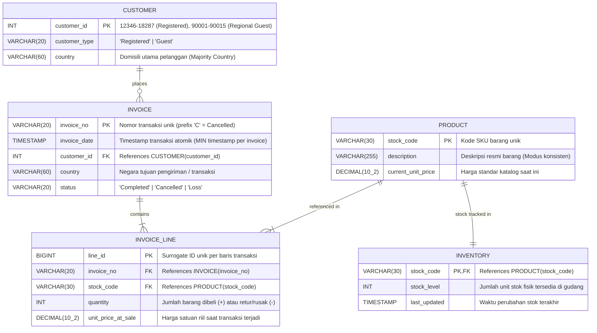

# KoDes Retail — 3NF Entity-Relationship Diagram (ERD) & Architecture

Dokumen arsitektur relasional ini dirancang khusus untuk database overhaul **KoDes Retail**, menggabungkan analisis terbaik tim:
- **Pemisahan 3NF Murni (Third Normal Form)** tanpa *transitive dependency* maupun *derived attribute redundancy*.
- **Pencatatan Negara Pengiriman di Level Transaksi** (`INVOICE.country`) untuk mempermudah pelaporan regional (Query 3) dan mendukung pengiriman internasional.
- **Pemisahan Harga Katalog vs Harga Historis Penjualan** (`PRODUCT.current_unit_price` vs `INVOICE_LINE.unit_price_at_sale`).
- **Kesiapan Otomasi Gudang** (`INVENTORY` 1:1 dengan `PRODUCT` untuk trigger Phase 4).

---

## 1. Diagram ERD Relasional (Crow's Foot Notation)

---

## 2. Kardinalitas & Tindakan Integritas Referensial (Foreign Keys)

| Relasi | Kardinalitas | Parent Table | Child Table | Foreign Key | Referential Action |
| :--- | :--- | :--- | :--- | :--- | :--- |
| **places** | $1 : N$ | `CUSTOMER` | `INVOICE` | `customer_id` | `ON UPDATE CASCADE, ON DELETE RESTRICT` |
| **contains** | $1 : N$ | `INVOICE` | `INVOICE_LINE` | `invoice_no` | `ON UPDATE CASCADE, ON DELETE CASCADE` |
| **referenced in** | $1 : N$ | `PRODUCT` | `INVOICE_LINE` | `stock_code` | `ON UPDATE CASCADE, ON DELETE RESTRICT` |
| **stock tracked in** | $1 : 1$ | `PRODUCT` | `INVENTORY` | `stock_code` | `ON UPDATE CASCADE, ON DELETE CASCADE` |

---

## 3. Kamus Data (Data Dictionary)

### Tabel: `CUSTOMER`
| Kolom | Tipe Data | Constraint | Keterangan |
| :--- | :--- | :--- | :--- |
| `customer_id` | `INT` | `PRIMARY KEY` | ID pelanggan (12346–18287 = Member, 90001–90015 = Tamu Regional). |
| `customer_type` | `VARCHAR(20)` | `NOT NULL, CHECK (customer_type IN ('Registered', 'Guest'))` | Klasifikasi keanggotaan pelanggan. |
| `country` | `VARCHAR(60)` | `NOT NULL` | Negara domisili tetap (dihitung dari mayoritas riwayat transaksi). |

> **Catatan Kritis 3NF:** Kolom `first_purchase_date` dan `last_purchase_date` sengaja **tidak dibuat sebagai kolom fisik** di tabel `CUSTOMER` karena merupakan *derived attributes* yang melanggar aturan Third Normal Form murni. Sebagai gantinya, disediakan **SQL View** `view_customer_rfm` untuk keperluan pelaporan CRM.

---

### Tabel: `INVOICE`
| Kolom | Tipe Data | Constraint | Keterangan |
| :--- | :--- | :--- | :--- |
| `invoice_no` | `VARCHAR(20)` | `PRIMARY KEY` | Nomor faktur pesanan. |
| `invoice_date` | `TIMESTAMP` | `NOT NULL` | Waktu transaksi resmi (diambil dari `MIN(InvoiceDate)` per nomor invoice). |
| `customer_id` | `INT` | `NOT NULL, FK REFERENCES CUSTOMER(customer_id)` | Pelanggan pemilik transaksi. |
| `country` | `VARCHAR(60)` | `NOT NULL` | Negara transaksi/tujuan pengiriman barang. |
| `status` | `VARCHAR(20)` | `NOT NULL, CHECK (status IN ('Completed', 'Cancelled', 'Loss'))` | Status transaksi (Selesai, Batal, atau Kerugian/Adjustment Gudang). |

---

### Tabel: `PRODUCT`
| Kolom | Tipe Data | Constraint | Keterangan |
| :--- | :--- | :--- | :--- |
| `stock_code` | `VARCHAR(30)` | `PRIMARY KEY` | Kode SKU produk unik (e.g. `85123A`, `21733`). |
| `description` | `VARCHAR(255)` | `NOT NULL` | Nama barang resmi (hasil konsistensi modus mayoritas). |
| `current_unit_price` | `DECIMAL(10,2)` | `NOT NULL, CHECK (current_unit_price >= 0.00)` | Harga standar katalog saat ini (median harga transaksi positif). |

---

### Tabel: `INVENTORY`
| Kolom | Tipe Data | Constraint | Keterangan |
| :--- | :--- | :--- | :--- |
| `stock_code` | `VARCHAR(30)` | `PRIMARY KEY, FK REFERENCES PRODUCT(stock_code)` | Kode SKU produk yang dilacak. |
| `stock_level` | `INT` | `NOT NULL, DEFAULT 1000` | Sisa stok fisik di gudang. |
| `last_updated` | `TIMESTAMP` | `NOT NULL, DEFAULT CURRENT_TIMESTAMP` | Waktu perubahan inventaris terakhir. |

---

### Tabel: `INVOICE_LINE`
| Kolom | Tipe Data | Constraint | Keterangan |
| :--- | :--- | :--- | :--- |
| `line_id` | `BIGINT` | `PRIMARY KEY` | Surrogate Key unik per baris barang. |
| `invoice_no` | `VARCHAR(20)` | `NOT NULL, FK REFERENCES INVOICE(invoice_no)` | Nomor invoice induk. |
| `stock_code` | `VARCHAR(30)` | `NOT NULL, FK REFERENCES PRODUCT(stock_code)` | Produk yang dibeli. |
| `quantity` | `INT` | `NOT NULL` | Kuantitas barang (positif = jual, negatif = retur/loss). |
| `unit_price_at_sale` | `DECIMAL(10,2)` | `NOT NULL, CHECK (unit_price_at_sale >= 0.00)` | Harga satuan riil pada saat transaksi terjadi. |

---

## 4. Pembuktian Normalisasi 3NF (Formal Proof)

1. **1NF (First Normal Form):**  
   Semua kolom bernilai skalar atomik (tidak ada nested json, composite data, atau list berulang). Setiap tabel memiliki Primary Key unik.
2. **2NF (Second Normal Form):**  
   Berada dalam 1NF dan tidak ada *partial dependency*. Kolom-kolom di `INVOICE_LINE` bergantung penuh pada `line_id`; deskripsi dan harga produk bergantung penuh pada `stock_code`.
3. **3NF (Third Normal Form):**  
   Berada dalam 2NF dan tidak ada *transitive dependency* ($X \to Y \to Z$).
   - Hubungan harga historis vs katalog dipisah: harga saat beli disimpan di `INVOICE_LINE.unit_price_at_sale`, sedangkan harga katalog terkini ada di `PRODUCT.current_unit_price`.
   - Menghindari *derived columns*: Atribut turunan seperti total belanja atau tanggal belanja terakhir dipindahkan ke layer **View SQL**, menjaga integritas data master tetap bersih.
